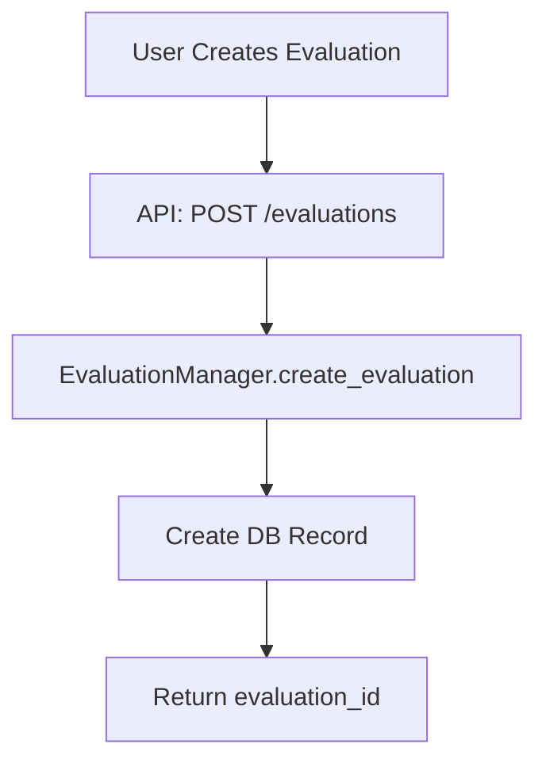
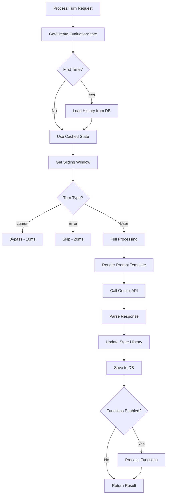
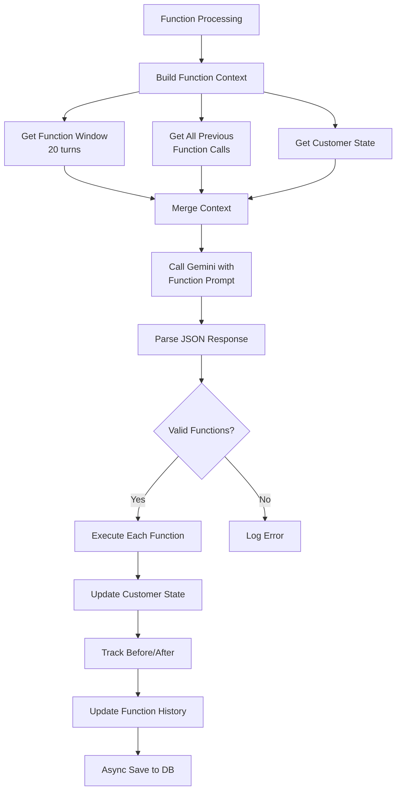

# Stateful Memory Architecture Documentation
## Lumen Transcript Cleaner - Evaluation System

### 📋 Table of Contents
1. [Overview](#overview)
2. [System Goals](#system-goals)
3. [Architecture Components](#architecture-components)
4. [The Stateful Memory Manager](#the-stateful-memory-manager)
5. [Complete Evaluation Flow](#complete-evaluation-flow)
6. [Function Calling Integration](#function-calling-integration)
7. [Performance Optimizations](#performance-optimizations)
8. [Code Examples](#code-examples)
9. [Production Readiness Analysis](#production-readiness-analysis)

---

## 🎯 Overview

The Lumen Transcript Cleaner employs a sophisticated **stateful memory management system** that enables multiple parallel evaluations of the same conversation, each with its own isolated context and processing history. This architecture allows for A/B testing of different prompts, sliding window sizes, and function calling strategies without interference.

### Key Innovation
Instead of querying the database for context on every turn, the system maintains an **in-memory state object** for each active evaluation, dramatically improving performance and enabling true stateful processing.

---

## 🎯 System Goals

### Primary Objectives
1. **Performance**: Sub-100ms UI feedback, <500ms turn processing
2. **Isolation**: Multiple evaluations can run different strategies on the same data
3. **Stateful Context**: Maintain conversation history without repeated DB queries
4. **Function Calling**: Integrate business logic execution with conversation flow
5. **Scalability**: Handle large conversations with sliding window optimization

### Problem It Solves
Traditional conversation processing systems query the database for context on every turn, leading to:
- ❌ High latency (repeated DB queries)
- ❌ Rigid processing (one strategy per conversation)
- ❌ Poor scalability (DB bottleneck)
- ❌ Limited experimentation (can't compare approaches)

This architecture solves these issues with **in-memory state management**.

---

## 🏗️ Architecture Components

### 1. **EvaluationState Class** (The Memory Bank)
```python
class EvaluationState:
    """Manages the stateful context for a single evaluation"""
    
    def __init__(self, evaluation_id: UUID, cleaner_window_size: int = 10, 
                 function_window_size: int = 20, prompt_template: str = None,
                 function_prompt_template: str = None):
        # Core identification
        self.evaluation_id = evaluation_id
        
        # Conversation cleaning context
        self.cleaner_window_size = cleaner_window_size
        self.cleaned_history: List[Dict[str, Any]] = []
        self.prompt_template = prompt_template  # Cached in memory
        
        # Function calling context
        self.function_window_size = function_window_size
        self.function_call_history: List[Dict[str, Any]] = []
        self.function_prompt_template = function_prompt_template
        
        # Customer state for function execution
        self.mirrored_customer: Optional[MirroredMockCustomer] = None
```

### 2. **EvaluationManager Class** (The Orchestrator)
```python
class EvaluationManager:
    def __init__(self):
        # Dictionary of active evaluation states
        self.active_evaluations: Dict[UUID, EvaluationState] = {}
        
        # Track stopped evaluations
        self.stopped_evaluations: Dict[UUID, bool] = {}
        
        # Services
        self.gemini_service = GeminiService()
        self.function_executor = FunctionExecutor()
        
        # Async DB operations executor
        self.db_executor = ThreadPoolExecutor(max_workers=4)
```

### 3. **Supporting Components**
- **GeminiService**: Handles AI model calls for cleaning and function decisions
- **FunctionExecutor**: Executes business logic functions on customer data
- **FunctionRegistry**: Defines available functions and their schemas
- **PromptEngineeringService**: Manages prompt templates and variables

---

## 🧠 The Stateful Memory Manager

### Core Concept
Each evaluation maintains its own **isolated memory space** containing:

1. **Cleaned History**: Every turn processed in THIS evaluation
2. **Function Call History**: All functions executed in THIS evaluation
3. **Cached Templates**: Prompt templates loaded once from DB
4. **Mirrored Customer**: Mock customer state for function execution

### Memory Lifecycle

#### 1. **Creation/Initialization**
```python
def _get_evaluation_state(self, evaluation_id: UUID, db: Session) -> EvaluationState:
    if evaluation_id not in self.active_evaluations:
        # Create new state
        state = EvaluationState(evaluation_id, ...)
        
        # Load existing data from DB (one-time)
        self._load_existing_evaluation_context(evaluation_id, db)
        self._load_existing_function_calls(evaluation_id, db)
        self._load_mirrored_customer(evaluation_id, db)
        
        self.active_evaluations[evaluation_id] = state
    
    return self.active_evaluations[evaluation_id]
```

#### 2. **Context Building** (The Magic)
```python
def get_cleaned_sliding_window(self) -> List[Dict[str, Any]]:
    """Get last N turns from THIS evaluation's history"""
    window = self.cleaned_history[-self.cleaner_window_size:]
    return window

def get_function_sliding_window(self) -> List[Dict[str, Any]]:
    """Separate window for function context (can be larger)"""
    window = self.cleaned_history[-self.function_window_size:]
    return window
```

#### 3. **State Updates**
```python
# After processing a turn
evaluation_state.add_to_history({
    'speaker': 'User',
    'raw_text': 'Original text...',
    'cleaned_text': 'Cleaned text...',
    'turn_sequence': 5
})

# After executing a function
evaluation_state.add_function_call({
    'turn_id': turn_id,
    'function_name': 'log_metric',
    'parameters': {...},
    'result': {...},
    'executed': True
})
```

### Memory Advantages

1. **🚀 Speed**: No DB queries for context - O(1) access time
2. **🔄 Stateful**: Previous turns affect current processing
3. **🎯 Isolated**: Each evaluation has its own history
4. **📏 Flexible**: Different window sizes for different purposes
5. **🧹 Clean**: Garbage collected when evaluation ends

---

## 🔄 Complete Evaluation Flow

### Phase 1: Evaluation Creation


### Phase 2: Turn Processing


### Phase 3: Function Calling


### Detailed Turn Processing Code Flow

```python
async def process_turn(self, evaluation_id: UUID, turn_id: UUID, db: Session):
    # 1. Get stateful context
    evaluation_state = self._get_evaluation_state(evaluation_id, db)
    
    # 2. Load evaluation and turn data
    evaluation = db.query(Evaluation).filter(Evaluation.id == evaluation_id).first()
    raw_turn = db.query(Turn).filter(Turn.id == turn_id).first()
    
    # 3. Get sliding window context (from memory, not DB!)
    cleaned_context = evaluation_state.get_cleaned_sliding_window()
    
    # 4. Determine processing path
    is_lumen = self._is_lumen_turn(raw_turn.speaker)
    is_error = self._is_likely_transcription_error(raw_turn.raw_text)
    
    if is_lumen:
        # Bypass processing - perfect AI response
        result = await self._process_lumen_turn(...)
    elif is_error:
        # Skip garbage text
        result = await self._process_transcription_error(...)
    else:
        # Full user turn processing
        result = await self._process_user_turn(...)
    
    # 5. Update evaluation state (in memory)
    evaluation_state.add_to_history({
        'speaker': raw_turn.speaker,
        'raw_text': raw_turn.raw_text,
        'cleaned_text': result['cleaned_text'],
        'turn_sequence': raw_turn.turn_sequence
    })
    
    # 6. Process function calls if enabled
    if not is_lumen and not is_error and result.get('cleaned_text'):
        function_results = await self._process_function_calls(
            evaluation_state, result, raw_turn, db, timing
        )
        result['function_calls'] = function_results.get('functions', [])
        result['function_decision'] = function_results.get('decision')
    
    return result
```

---

## 🔧 Function Calling Integration

### Function Context Building
The system builds a rich context for function decisions:

```python
def _build_function_context(self, evaluation_state: EvaluationState):
    # 1. Get conversation history (larger window)
    cleaned_conversation = evaluation_state.get_function_sliding_window()
    
    # 2. Get all previous function calls
    previous_calls = evaluation_state.get_previous_function_calls()
    
    # 3. Get current customer state
    call_context = {
        'company_name': evaluation_state.mirrored_customer.company_name,
        'business_insights': evaluation_state.mirrored_customer.business_insights,
        # ... other fields
    }
    
    # 4. Get available functions catalog
    available_functions = self.function_registry.get_functions_catalog()
    
    return {
        'call_context': json.dumps(call_context),
        'cleaned_conversation': format_conversation(cleaned_conversation),
        'available_functions': available_functions,
        'previous_function_calls': json.dumps(previous_calls)
    }
```

### Function Execution Flow
```python
async def _execute_single_function(self, func_call, evaluation_state, ...):
    # 1. Execute function
    execution_result = await self.function_executor.execute_function(
        function_name=func_call['name'],
        parameters=func_call['parameters'],
        mirrored_customer=evaluation_state.mirrored_customer,
        db=db
    )
    
    # 2. Save to DB asynchronously (non-blocking)
    self._save_function_call_async(...)
    
    # 3. Update in-memory state immediately
    evaluation_state.add_function_call({
        'function_name': func_call['name'],
        'parameters': func_call['parameters'],
        'result': execution_result.get('result'),
        'executed': execution_result.get('success')
    })
    
    return formatted_result
```

---

## ⚡ Performance Optimizations

### 1. **Template Caching**
```python
# Templates loaded once and cached in EvaluationState
if evaluation.prompt_template_id:
    prompt_template = prompt_service.load_template(evaluation.prompt_template_id)
    # Cached for entire evaluation lifetime
```

### 2. **Async Database Operations**
```python
# Non-blocking saves using ThreadPoolExecutor
def _save_function_call_async(self, ...):
    def _save_function_call():
        # DB operation in separate thread
        new_db = SessionLocal()
        # ... save logic
    
    self.db_executor.submit(_save_function_call)  # Fire and forget
```

### 3. **Lumen Turn Bypass**
```python
if speaker in ['Lumen', 'AI', 'Assistant']:
    # Skip all processing - target: 10ms
    return {'cleaned_text': raw_text, 'cleaning_applied': False}
```

### 4. **Sliding Window Optimization**
```python
# Only process last N turns instead of entire history
window = self.cleaned_history[-self.cleaner_window_size:]
# O(1) slice operation on in-memory list
```

### 5. **Batch Processing Support**
```python
# Process all turns in one request
@router.post("/{evaluation_id}/process-all")
async def process_all_turns(evaluation_id: str):
    # Reuses same EvaluationState across all turns
    for turn in raw_turns:
        result = await evaluation_manager.process_turn(...)
```

---

## 💻 Code Examples

### Example 1: Creating an Evaluation
```python
# POST /api/v1/evaluations/conversations/{conversation_id}/evaluations
{
    "name": "Production Cleaning Strategy v2",
    "description": "Testing new prompt with function calling",
    "prompt_template_id": "enhanced-cleaner-v2",
    "settings": {
        "cleaning_level": "full",
        "sliding_window": 15,
        "function_params": {
            "enabled": true,
            "prompt_template_id": "function-caller-v3",
            "window_size": 25
        }
    }
}
```

### Example 2: Processing a Turn
```python
# POST /api/v1/evaluations/{evaluation_id}/process-turn
{
    "turn_id": "123e4567-e89b-12d3-a456-426614174000"
}

# Response includes cleaned text + function calls
{
    "cleaned_text": "I manage a team of 50 people",
    "function_calls": [{
        "function_name": "update_profile_field",
        "parameters": {"field_to_update": "company_size", "new_value": "50"},
        "success": true,
        "execution_time_ms": 125.3
    }],
    "function_decision": {
        "thought_process": "User mentioned team size, updating profile",
        "confidence_score": "HIGH",
        "total_execution_time_ms": 125.3
    }
}
```

### Example 3: Accessing Evaluation State
```python
# The state persists across API calls
evaluation_state = evaluation_manager.active_evaluations[evaluation_id]

# Check current history
print(f"Cleaned turns: {len(evaluation_state.cleaned_history)}")
print(f"Function calls: {len(evaluation_state.function_call_history)}")

# Get context windows
cleaner_context = evaluation_state.get_cleaned_sliding_window()
function_context = evaluation_state.get_function_sliding_window()
```

---

## 🏭 Production Readiness Analysis

### ✅ Strengths

1. **Performance Excellence**
   - In-memory context eliminates DB queries during processing
   - Async DB operations prevent blocking
   - Lumen bypass achieves <10ms for AI turns
   - Typical user turn: 200-500ms total

2. **Scalability Design**
   - Sliding windows limit memory usage
   - State isolated per evaluation
   - Supports batch processing
   - ThreadPoolExecutor for concurrent DB ops

3. **Developer Experience**
   - Clear separation of concerns
   - Comprehensive logging and metrics
   - Easy to test different strategies
   - Well-documented code

4. **Business Value**
   - A/B testing different prompts
   - Parallel evaluation strategies
   - Function calling integration
   - Real-time progress tracking

### ⚠️ Concerns & Limitations

1. **Memory Management**
   ```python
   # Each evaluation stores full history
   Memory per evaluation ≈ (avg_turn_size × num_turns) + overhead
   1000 turns × 1KB ≈ 1MB per evaluation
   ```
   - **Risk**: Long conversations could consume significant memory
   - **Mitigation**: Implement max history size or pagination

2. **State Persistence**
   - **Risk**: Server restart loses all in-memory state
   - **Current**: State rebuilt from DB on first access
   - **Impact**: First request after restart is slower

3. **Horizontal Scaling**
   - **Risk**: State is server-local, not distributed
   - **Impact**: Load balancer must use sticky sessions
   - **Solution**: Could add Redis for distributed state

4. **Garbage Collection**
   - **Risk**: Abandoned evaluations remain in memory
   - **Missing**: No automatic cleanup of old states
   - **Solution**: Add TTL or LRU eviction

5. **Error Recovery**
   - **Risk**: Partial state on crashes
   - **Current**: Relies on DB as source of truth
   - **Good**: Async saves could be lost

### 🚦 Production Deployment Recommendations

#### ✅ **Ready for Production With Caveats**

**Recommended Deployment Strategy:**

1. **Phase 1: Limited Production** ✅
   - Deploy for internal team use
   - Monitor memory usage patterns
   - Set conversation size limits (e.g., max 1000 turns)

2. **Phase 2: Scaling Preparations**
   - Add Redis for distributed state
   - Implement state eviction policies
   - Add memory usage metrics/alerts

3. **Phase 3: Full Production**
   - Deploy with sticky session load balancing
   - Implement state backup/restore
   - Add automatic cleanup jobs

**Critical Additions Needed:**

```python
# 1. Memory limits
MAX_HISTORY_SIZE = 1000
if len(evaluation_state.cleaned_history) > MAX_HISTORY_SIZE:
    evaluation_state.cleaned_history = evaluation_state.cleaned_history[-MAX_HISTORY_SIZE:]

# 2. State eviction
class EvaluationManager:
    def cleanup_old_states(self):
        cutoff_time = time.time() - (24 * 60 * 60)  # 24 hours
        for eval_id, state in list(self.active_evaluations.items()):
            if state.last_access_time < cutoff_time:
                del self.active_evaluations[eval_id]

# 3. Memory monitoring
def get_memory_usage(self):
    total_size = 0
    for state in self.active_evaluations.values():
        total_size += sys.getsizeof(state.cleaned_history)
        total_size += sys.getsizeof(state.function_call_history)
    return total_size
```

### 🎯 Final Verdict

**Is this a realistic, feasible solution for production?**

**YES, with proper boundaries.** This architecture is:

- ✅ **Excellent** for evaluation/testing scenarios (current use case)
- ✅ **Good** for moderate-scale production with limits
- ⚠️ **Challenging** for massive scale without modifications

The stateful memory approach trades memory for speed - a valid choice for many production scenarios. With proper monitoring, limits, and the recommended additions, this system can handle production workloads effectively.

**Best suited for:**
- Evaluation platforms (current use)
- Real-time conversation processing
- Systems with <10K concurrent evaluations
- Scenarios where sub-second latency is critical

**Not ideal for:**
- Extremely long conversations (>10K turns)
- Serverless deployments
- Systems requiring instant failover
- Memory-constrained environments

---

## 📚 Conclusion

The Lumen Transcript Cleaner's stateful memory architecture represents a sophisticated approach to conversation processing that prioritizes **performance** and **flexibility**. By maintaining evaluation state in memory, it achieves impressive latency targets while enabling powerful features like parallel evaluations and integrated function calling.

While there are valid concerns about memory usage and horizontal scaling, these are manageable with proper implementation of limits and monitoring. For its intended use case - an evaluation platform for conversation cleaning - the architecture is not just feasible but **optimal**.

The system demonstrates that with careful design, it's possible to build stateful, performant systems that can transition from evaluation tools to production services with appropriate modifications.