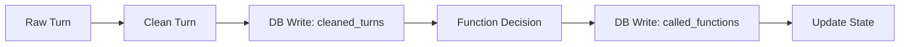
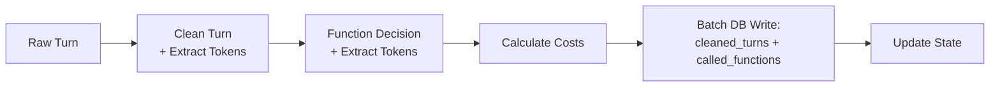

# In-Memory Processing and Cost Tracking Implementation Plan

## Executive Summary

This document outlines the implementation plan for refactoring the Lumen Transcript Cleaner's processing pipeline to use in-memory processing with batch database writes, while adding comprehensive cost tracking for Gemini API calls.

### Goals
1. **Reduce latency** by eliminating intermediate DB writes between cleaning and function calling
2. **Add cost tracking** for both cleaner and function caller Gemini API calls
3. **Maintain atomicity** with batch saves for better error handling
4. **Preserve existing functionality** while improving performance

### Expected Benefits
- **50% reduction in DB write operations** (from 2+ to 1 per turn)
- **~30-40ms latency reduction** per turn (eliminating intermediate DB commit)
- **Complete cost visibility** for all Gemini API usage
- **Atomic operations** preventing partial state corruption

## Current Architecture Analysis

### Processing Flow (As-Is)


### Database Operations Per Turn
- **First turn**: ~8-9 DB queries (state initialization)
- **Subsequent turns**: ~2-3 DB queries + 2 DB writes
- **Latency impact**: ~20-40ms per DB write operation

### Key Findings
1. **Good news**: Context retrieval already uses in-memory state (no DB hits)
2. **Problem**: Intermediate DB writes between cleaning and function calling
3. **Opportunity**: Batch both operations before any DB writes

## Proposed Architecture

### Processing Flow (To-Be)


### New Data Structures

```python
@dataclass
class TokenUsage:
    """Token usage from Gemini API response"""
    input_tokens: int
    output_tokens: int
    total_tokens: int
    
@dataclass
class ProcessingCost:
    """Cost calculation for API usage"""
    input_cost_usd: float
    output_cost_usd: float
    total_cost_usd: float

@dataclass
class CleaningResult:
    """In-memory cleaning result"""
    cleaned_text: str
    metadata: Dict[str, Any]
    raw_response: str
    prompt_used: str
    token_usage: TokenUsage
    cost: ProcessingCost
    processing_time_ms: float
    
@dataclass
class FunctionResult:
    """In-memory function calling result"""
    function_called: bool
    function_name: Optional[str]
    parameters: Optional[Dict[str, Any]]
    result: Optional[Dict[str, Any]]
    raw_response: str
    token_usage: TokenUsage
    cost: ProcessingCost
    processing_time_ms: float

@dataclass
class TurnProcessingResult:
    """Complete turn processing result"""
    turn_id: str
    cleaning_result: CleaningResult
    function_result: Optional[FunctionResult]
    total_cost_usd: float
    total_processing_time_ms: float
```

## Implementation Plan

### Phase 1: Database Schema Updates

#### 1.1 Add Cost Tracking Columns

**cleaned_turns table:**
```sql
ALTER TABLE cleaned_turns ADD COLUMN cleaning_input_tokens INTEGER DEFAULT 0;
ALTER TABLE cleaned_turns ADD COLUMN cleaning_output_tokens INTEGER DEFAULT 0;
ALTER TABLE cleaned_turns ADD COLUMN cleaning_cost_usd DECIMAL(10,6) DEFAULT 0.0;
ALTER TABLE cleaned_turns ADD COLUMN function_input_tokens INTEGER DEFAULT 0;
ALTER TABLE cleaned_turns ADD COLUMN function_output_tokens INTEGER DEFAULT 0;
ALTER TABLE cleaned_turns ADD COLUMN function_cost_usd DECIMAL(10,6) DEFAULT 0.0;
ALTER TABLE cleaned_turns ADD COLUMN total_api_cost_usd DECIMAL(10,6) DEFAULT 0.0;
```

**called_functions table:**
```sql
ALTER TABLE called_functions ADD COLUMN input_tokens INTEGER DEFAULT 0;
ALTER TABLE called_functions ADD COLUMN output_tokens INTEGER DEFAULT 0;
ALTER TABLE called_functions ADD COLUMN estimated_cost_usd DECIMAL(10,6) DEFAULT 0.0;
```

#### 1.2 Update SQLAlchemy Models

Update `/backend/app/models/cleaned_turn.py` and `/backend/app/models/called_function.py` with new columns.

### Phase 2: Gemini Service Updates

#### 2.1 Add Token Extraction and Cost Calculation

```python
# In gemini_service.py

# Pricing constants (Gemini 2.5 Flash-Lite official rates)
GEMINI_FLASH_LITE_INPUT_COST = 0.10   # $0.10 per 1M input tokens
GEMINI_FLASH_LITE_OUTPUT_COST = 0.40  # $0.40 per 1M output tokens

def extract_token_usage(response) -> TokenUsage:
    """Extract token usage from Gemini response"""
    if hasattr(response, 'usage_metadata'):
        usage = response.usage_metadata
        return TokenUsage(
            input_tokens=getattr(usage, 'prompt_token_count', 0),
            output_tokens=getattr(usage, 'candidates_token_count', 0),
            total_tokens=getattr(usage, 'total_token_count', 0)
        )
    return TokenUsage(0, 0, 0)

def calculate_cost(token_usage: TokenUsage) -> ProcessingCost:
    """Calculate cost based on token usage"""
    input_cost = (token_usage.input_tokens / 1_000_000) * GEMINI_FLASH_LITE_INPUT_COST
    output_cost = (token_usage.output_tokens / 1_000_000) * GEMINI_FLASH_LITE_OUTPUT_COST
    return ProcessingCost(
        input_cost_usd=input_cost,
        output_cost_usd=output_cost,
        total_cost_usd=input_cost + output_cost
    )
```

#### 2.2 Update Response Methods

Modify `clean_conversation_turn` and `call_with_native_tools` to return token usage alongside existing data.

### Phase 3: Evaluation Manager Refactor

#### 3.1 Create New Process Turn Method

```python
async def process_turn_batch(self, evaluation_id: str, turn_id: str, db: Session) -> TurnProcessingResult:
    """New batch processing method with in-memory operations"""
    start_time = time.time()
    
    # Load evaluation state (cached after first load)
    evaluation_state = self.get_evaluation_state(evaluation_id, db)
    
    # Get turn data
    raw_turn = db.query(Turn).filter(Turn.id == turn_id).first()
    
    # Phase 1: Clean turn (in-memory only)
    cleaning_result = await self._clean_turn_with_tokens(
        raw_turn, evaluation_state
    )
    
    # Phase 2: Function decision (in-memory, uses cleaned text)
    function_result = None
    if raw_turn.speaker == "User" and cleaning_result.cleaned_text:
        function_result = await self._process_function_with_tokens(
            cleaning_result, evaluation_state
        )
    
    # Phase 3: Calculate total costs
    total_cost = cleaning_result.cost.total_cost_usd
    if function_result:
        total_cost += function_result.cost.total_cost_usd
    
    # Phase 4: Batch save with transaction
    await self._batch_save_results(
        db, evaluation_id, raw_turn, cleaning_result, function_result
    )
    
    # Phase 5: Update in-memory state
    self._update_evaluation_state(evaluation_state, cleaning_result, function_result)
    
    total_time = (time.time() - start_time) * 1000
    
    return TurnProcessingResult(
        turn_id=turn_id,
        cleaning_result=cleaning_result,
        function_result=function_result,
        total_cost_usd=total_cost,
        total_processing_time_ms=total_time
    )
```

#### 3.2 Implement Batch Save Method

```python
async def _batch_save_results(
    self, 
    db: Session, 
    evaluation_id: str,
    raw_turn: Turn,
    cleaning_result: CleaningResult,
    function_result: Optional[FunctionResult]
):
    """Atomically save all results in a single transaction"""
    try:
        # Create cleaned turn record with cost data
        cleaned_turn = CleanedTurn(
            id=str(uuid.uuid4()),
            turn_id=raw_turn.id,
            evaluation_id=evaluation_id,
            cleaned_text=cleaning_result.cleaned_text,
            confidence_score=cleaning_result.metadata.get("confidence_score"),
            cleaning_applied=cleaning_result.metadata.get("cleaning_applied"),
            cleaning_level=cleaning_result.metadata.get("cleaning_level"),
            ai_model_used=cleaning_result.metadata.get("ai_model_used"),
            processing_time_ms=cleaning_result.processing_time_ms,
            # New cost fields
            cleaning_input_tokens=cleaning_result.token_usage.input_tokens,
            cleaning_output_tokens=cleaning_result.token_usage.output_tokens,
            cleaning_cost_usd=cleaning_result.cost.total_cost_usd,
            # Function cost fields (even if no function called)
            function_input_tokens=function_result.token_usage.input_tokens if function_result else 0,
            function_output_tokens=function_result.token_usage.output_tokens if function_result else 0,
            function_cost_usd=function_result.cost.total_cost_usd if function_result else 0.0,
            total_api_cost_usd=cleaning_result.cost.total_cost_usd + (function_result.cost.total_cost_usd if function_result else 0.0)
        )
        
        db.add(cleaned_turn)
        
        # Create function call record if function was called
        if function_result and function_result.function_called:
            called_function = CalledFunction(
                id=str(uuid.uuid4()),
                cleaned_turn_id=cleaned_turn.id,
                evaluation_id=evaluation_id,
                function_name=function_result.function_name,
                parameters=function_result.parameters,
                result=function_result.result,
                processing_time_ms=function_result.processing_time_ms,
                # New cost fields
                input_tokens=function_result.token_usage.input_tokens,
                output_tokens=function_result.token_usage.output_tokens,
                estimated_cost_usd=function_result.cost.total_cost_usd
            )
            db.add(called_function)
        
        # Commit everything atomically
        db.commit()
        
    except Exception as e:
        db.rollback()
        logger.error(f"Failed to save batch results: {e}")
        raise
```

### Phase 4: Migration Strategy

#### 4.1 Parallel Implementation
1. Keep existing `process_turn` method intact
2. Implement new `process_turn_batch` method alongside
3. Add feature flag to switch between old and new implementation

#### 4.2 Gradual Rollout
```python
# In evaluation_manager.py
USE_BATCH_PROCESSING = os.getenv("USE_BATCH_PROCESSING", "false").lower() == "true"

async def process_turn(self, evaluation_id: str, turn_id: str, db: Session):
    if USE_BATCH_PROCESSING:
        return await self.process_turn_batch(evaluation_id, turn_id, db)
    else:
        return await self.process_turn_legacy(evaluation_id, turn_id, db)
```

#### 4.3 Testing Strategy
1. Unit tests for new data structures and cost calculations
2. Integration tests for batch processing flow
3. A/B testing with feature flag in staging
4. Monitor latency improvements and cost tracking accuracy

### Phase 5: Monitoring and Reporting

#### 5.1 Cost Dashboard Queries
```sql
-- Daily API costs by evaluation
SELECT 
    DATE(created_at) as date,
    evaluation_id,
    SUM(total_api_cost_usd) as daily_cost,
    SUM(cleaning_input_tokens + cleaning_output_tokens) as cleaning_tokens,
    SUM(function_input_tokens + function_output_tokens) as function_tokens
FROM cleaned_turns
GROUP BY DATE(created_at), evaluation_id
ORDER BY date DESC;

-- Cost breakdown by model
SELECT 
    ai_model_used,
    COUNT(*) as api_calls,
    SUM(cleaning_cost_usd) as total_cleaning_cost,
    SUM(function_cost_usd) as total_function_cost,
    AVG(cleaning_input_tokens) as avg_input_tokens,
    AVG(cleaning_output_tokens) as avg_output_tokens
FROM cleaned_turns
GROUP BY ai_model_used;
```

#### 5.2 Performance Metrics
- Track average processing time reduction
- Monitor DB connection pool usage
- Measure cost tracking accuracy

## Risk Mitigation

### 1. Error Recovery
- Implement comprehensive error logging
- Add retry logic with exponential backoff
- Maintain transaction boundaries for atomicity

### 2. Data Consistency
- Add validation before batch saves
- Implement health checks for evaluation state
- Create data reconciliation scripts

### 3. Performance Degradation
- Monitor memory usage of in-memory structures
- Set limits on batch sizes
- Implement circuit breakers for API calls

## Success Metrics

1. **Latency Reduction**: Target 30-40ms reduction per turn
2. **Cost Visibility**: 100% of API calls tracked with costs
3. **Error Rate**: Maintain or improve current error rates
4. **Database Efficiency**: 50% reduction in write operations

## Timeline

- **Week 1**: Database schema updates and model changes
- **Week 2**: Gemini service updates for token extraction
- **Week 3**: Implement batch processing in evaluation manager
- **Week 4**: Testing and gradual rollout with feature flags
- **Week 5**: Monitoring setup and performance optimization

## Conclusion

This implementation plan provides a clear path to improve performance while adding comprehensive cost tracking. The phased approach with feature flags ensures safe deployment with minimal risk to existing functionality.